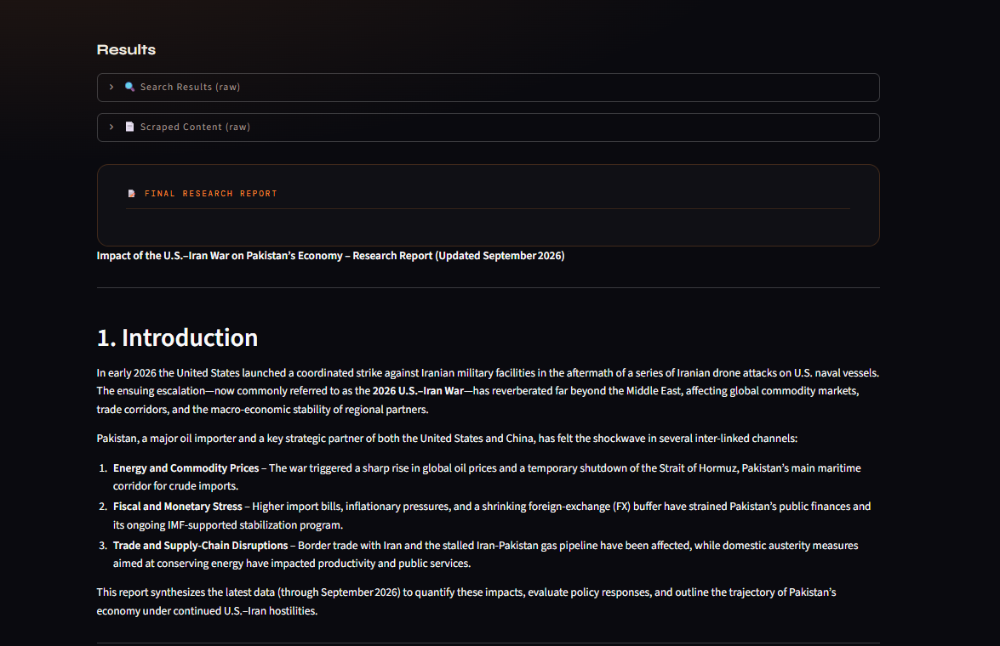

# Multi-Agent AI Research

An AI-powered multi-agent research system that automates the process of **web research, source extraction, report generation, and report evaluation**.

The system divides the research workflow into four specialized stages:

**Search → Read → Write → Critique**

Each stage is handled by a dedicated agent or LLM chain, creating a modular research pipeline rather than relying on a single prompt.

## Live Demo

**Streamlit:**
https://sheryar-ai-research-agent.streamlit.app

**GitHub:**
https://github.com/Sheryar-Akhtar/multi-agent-ai-research

---

## Overview

Researching a topic manually usually requires several repetitive steps:

1. Search for relevant information.
2. Open and read useful sources.
3. Extract important information.
4. Write the research report.
5. Review the report for quality and completeness.

This project automates these steps through a multi-agent architecture.

The user provides a research topic, and the system automatically performs the research workflow.

```text
                    User
                     │
                     ▼
              Research Topic
                     │
                     ▼
          ┌───────────────────┐
          │   Search Agent    │
          │                   │
          │   Tavily Search   │
          └─────────┬─────────┘
                    │
                    ▼
          ┌───────────────────┐
          │   Reader Agent    │
          │                   │
          │  URL Scraping     │
          └─────────┬─────────┘
                    │
                    ▼
          ┌───────────────────┐
          │   Writer Agent    │
          │                   │
          │ Research Report   │
          └─────────┬─────────┘
                    │
                    ▼
          ┌───────────────────┐
          │   Critic Agent    │
          │                   │
          │ Report Evaluation │
          └─────────┬─────────┘
                    │
                    ▼
              Final Output
```

---

# Key Features

* Multi-agent AI research workflow
* Automated web search
* Relevant source selection
* Webpage scraping and content extraction
* Structured research report generation
* AI-powered report evaluation
* Critic scoring and improvement suggestions
* Streamlit web interface
* Docker containerization
* Groq LLM integration
* Tavily web search integration
* Custom LangChain tools
* Environment-variable based secret management
* Cloud deployment through Streamlit Community Cloud

---

# Multi-Agent Architecture

The project contains four main research stages.

## 1. Search Agent

The Search Agent is responsible for finding relevant information on the web.

It receives the user's research topic and uses the custom `web_search` tool.

### Responsibilities

* Understand the research topic
* Search for recent and relevant information
* Identify useful sources
* Return titles, URLs, and snippets

### Tool

```text
web_search(query)
```

The tool uses **Tavily** to perform web searches.

### Flow

```text
Research Topic
      │
      ▼
Search Agent
      │
      ▼
Tavily Web Search
      │
      ▼
Search Results
```

---

## 2. Reader Agent

The Reader Agent receives the search results and identifies a relevant source for deeper research.

It then uses the `scrape_url` tool to retrieve and extract the webpage content.

### Responsibilities

* Analyze search results
* Select a relevant URL
* Scrape the selected webpage
* Extract useful text
* Remove unnecessary HTML elements
* Provide detailed research material

### Tool

```text
scrape_url(url)
```

The scraping process uses:

* `requests`
* `BeautifulSoup`

### Flow

```text
Search Results
      │
      ▼
Reader Agent
      │
      ▼
Relevant URL
      │
      ▼
Web Scraper
      │
      ▼
Detailed Page Content
```

---

## 3. Writer Agent

The Writer Agent receives the information gathered by the Search and Reader Agents.

The research material is combined before being passed to the Writer.

```text
SEARCH RESULTS

+

DETAILED SCRAPED CONTENT
```

The Writer then generates a structured research report.

### Report Structure

```text
# Introduction

# Key Findings

# Conclusion

# Sources
```

The Writer is instructed to:

* Use the provided research material
* Remain factual
* Avoid inventing information
* Avoid inventing sources
* Produce a professional research structure

### Flow

```text
Search Results
      +
Scraped Content
      │
      ▼
Writer Agent
      │
      ▼
Research Report
```

---

## 4. Critic Agent

The Critic Agent evaluates the generated research report.

Instead of treating the Writer's output as final, the report is passed through a separate evaluation stage.

### Evaluation Criteria

The Critic checks:

* Factual quality
* Clarity
* Structure
* Completeness
* Usefulness

### Output

```text
Score: X/10

Strengths:
- ...
- ...

Areas to Improve:
- ...
- ...

One line verdict:
...
```

### Flow

```text
Research Report
      │
      ▼
Critic Agent
      │
      ▼
Score + Feedback
```

---

# Complete Research Pipeline

The complete system works sequentially:

```text
                    ┌──────────────┐
                    │     User     │
                    └──────┬───────┘
                           │
                           ▼
                    Research Topic
                           │
                           ▼
                 ┌──────────────────┐
                 │   Search Agent   │
                 └────────┬─────────┘
                          │
                          ▼
                    Tavily Search
                          │
                          ▼
                   Search Results
                          │
                          ▼
                 ┌──────────────────┐
                 │   Reader Agent   │
                 └────────┬─────────┘
                          │
                          ▼
                    URL Scraping
                          │
                          ▼
                 Scraped Content
                          │
                          ▼
                 ┌──────────────────┐
                 │   Writer Agent   │
                 └────────┬─────────┘
                          │
                          ▼
                   Research Report
                          │
                          ▼
                 ┌──────────────────┐
                 │   Critic Agent   │
                 └────────┬─────────┘
                          │
                          ▼
                 Evaluation & Score
```

---

# Technology Stack

| Technology       | Purpose                             |
| ---------------- | ------------------------------------ |
| Python           | Core programming language           |
| LangChain        | LLM application and agent framework |
| LangChain Agents | Agent creation and tool integration |
| Groq             | LLM inference                       |
| GPT-OSS 20B      | Language model                      |
| Tavily           | Web search                          |
| Requests         | HTTP requests                       |
| BeautifulSoup    | HTML parsing and webpage extraction |
| Streamlit        | Web application interface           |
| Docker           | Containerization                    |
| python-dotenv    | Environment variable management     |
| Rich             | Terminal output formatting          |

---

# LLM

The project uses **Groq** for LLM inference.

The configured model is:

```text
openai/gpt-oss-20b
```

The LLM is used across the research workflow for:

* Agent reasoning
* Tool selection
* Research writing
* Report evaluation

---

# Custom Tools

The project contains two custom LangChain tools.

## Web Search

```python
@tool
def web_search(query: str) -> str:
```

The tool accepts a normal text query and uses Tavily to retrieve search results.

Each result provides:

* Title
* URL
* Content snippet

---

## Web Scraper

```python
@tool
def scrape_url(url: str) -> str:
```

The scraper retrieves the webpage and extracts readable content.

The process:

```text
URL
 │
 ▼
Requests
 │
 ▼
HTML Response
 │
 ▼
BeautifulSoup
 │
 ▼
Remove script/style/navigation/footer
 │
 ▼
Readable Text
```

---

# Project Structure

```text
multi-agent-ai-research/
│
├── agents.py
├── app.py
├── main.py
├── pipeline.py
├── tools.py
│
├── Dockerfile
├── .dockerignore
├── .gitignore
├── requirements.txt
├── pyproject.toml
├── README.md
│
└── .env
```

### `agents.py`

Contains:

* Groq LLM configuration
* Search Agent
* Reader Agent
* Writer chain
* Critic chain


---

### `tools.py`

Contains the custom tools:

```text
web_search()
scrape_url()
```

These tools provide the external capabilities required by the agents.


---

### `pipeline.py`

Contains the sequential research workflow.

The pipeline maintains intermediate results and passes information from one stage to the next.

```text
Search
  ↓
Reader
  ↓
Writer
  ↓
Critic
```


---

### `app.py`

Contains the Streamlit interface.

It provides the user-facing application and displays the progress/results of each research stage.

---

### `main.py`

Provides the project's main application entry point.

---

# Streamlit Application

The project includes an interactive Streamlit interface.

The user enters a research topic and starts the research process.

The application then displays the progress of:

```text
🔍 Search Agent
      ↓
📄 Reader Agent
      ↓
✍️ Writer
      ↓
🧐 Critic
```

### Application Screenshot


*The ResearchMind homepage — enter a research topic, run the pipeline, and watch each agent (Search, Reader, Writer, Critic) complete in sequence.*

---

# Search Results

The Search Agent retrieves relevant sources using Tavily.

### Screenshot

> Add screenshot here.

```text
screenshots/search-results.png
```

---

# Reader / Scraping Stage

The Reader Agent selects a relevant URL and extracts detailed content from the webpage.

### Screenshot

> Add screenshot here.

```text
screenshots/reader-agent.png
```

---

# Generated Research Report

The Writer Agent converts the gathered research into a structured report.

### Screenshot



*The Results panel (with the raw Search Results and Scraped Content available in expandable sections) followed by the report's Introduction.*


*The Key Findings section, pairing each finding with its evidence/impact and policy implications.*

---

# Critic Evaluation

The Critic Agent evaluates the generated report and provides a score, strengths, areas for improvement, and a final verdict.

### Screenshot


*The Cross-Sector Impact Summary table alongside the Critic Agent's feedback — score, strengths, and areas to improve.*

---

# Docker Support

The project is containerized using Docker.

The Docker image is based on:

```dockerfile
FROM python:3.12-slim
```

The Streamlit application runs on port:

```text
8501
```

The container starts the application with:

```text
streamlit run app.py --server.address=0.0.0.0 --server.port=8501
```

---

# Run with Docker

## Build the Image

```bash
docker build -t multi-agent-ai-research .
```

## Run the Container

```bash
docker run --env-file .env -p 8501:8501 multi-agent-ai-research
```

The application will be available at:

```text
http://localhost:8501
```

---

# Local Installation

## 1. Clone the Repository

```bash
git clone https://github.com/Sheryar-Akhtar/multi-agent-ai-research.git
```

## 2. Enter the Directory

```bash
cd multi-agent-ai-research
```

## 3. Create a Virtual Environment

```bash
python -m venv .venv
```

## 4. Activate the Environment

### Windows PowerShell

```powershell
.venv\Scripts\Activate.ps1
```

## 5. Install Dependencies

```bash
pip install -r requirements.txt
```

---

# Environment Variables

Create a `.env` file in the project root:

```env
GROQ_API_KEY=your_groq_api_key
TAVILY_API_KEY=your_tavily_api_key
```

### Required API Keys

| Variable         | Purpose         |
| ---------------- | --------------- |
| `GROQ_API_KEY`   | Groq LLM access |
| `TAVILY_API_KEY` | Web search      |

**Never commit API keys to GitHub.**

The `.env` file is excluded through `.gitignore`.

---

# Run Locally

After configuring the environment variables:

```bash
streamlit run app.py
```

Streamlit will provide a local URL in the terminal.

---

# Deployment

The application is deployed through **Streamlit Community Cloud**.

### Deployment Configuration

```text
Repository:
Sheryar-Akhtar/multi-agent-ai-research

Branch:
main

Entry Point:
app.py

Python:
3.12
```

The application is also Docker-compatible, allowing the same project to be run in a containerized environment.

---

# Example

A user can enter a topic such as:

```text
Latest developments in Generative AI
```

The system automatically performs:

```text
1. Search the web
        ↓
2. Select a relevant source
        ↓
3. Scrape the source
        ↓
4. Combine research material
        ↓
5. Generate a structured report
        ↓
6. Critically evaluate the report
```

The final result contains both:

* The generated research report
* The Critic Agent's evaluation

---

# Why Use Multiple Agents?

A single LLM could be prompted to perform the entire workflow, but separating responsibilities provides a clearer and more modular architecture.

Each component has a focused role:

| Component    | Responsibility        |
| ------------ | ---------------------- |
| Search Agent | Information discovery |
| Reader Agent | Source extraction     |
| Writer Agent | Report generation     |
| Critic Agent | Report evaluation     |

This architecture makes it easier to:

* Debug individual stages
* Improve individual prompts
* Replace individual tools
* Add additional research agents
* Extend the workflow
* Evaluate each stage independently

---

# What This Project Demonstrates

This project demonstrates practical experience with:

### Generative AI

* LLM integration
* Prompt engineering
* Structured LLM outputs
* LLM-based evaluation

### Agentic AI

* AI agent creation
* Tool calling
* Specialized agents
* Agent-based workflows
* Sequential multi-agent orchestration

### LangChain

* `create_agent`
* Custom tools
* Chat models
* Prompt templates
* Output parsers
* Runnable chains

### External Tools

* Tavily web search
* Requests
* BeautifulSoup

### Application Development

* Streamlit
* Environment configuration
* Modular Python architecture

### Deployment

* Docker
* Streamlit Community Cloud
* Git
* GitHub

---

# Future Improvements

Potential improvements for future versions include:

* Multiple Reader Agents working in parallel
* Multiple search providers
* Source credibility verification
* Automatic citation generation
* Parallel research across multiple sources
* Persistent research history
* Downloadable PDF reports
* Human feedback loops
* Research result caching
* More advanced report fact-checking
* Specialized domain-specific research agents

---

# Project Status

**Status: Deployed and Working**

The complete research workflow has been tested through the deployed Streamlit application.

Current pipeline:

```text
Search Agent
      ↓
Reader Agent
      ↓
Writer Agent
      ↓
Critic Agent
      ↓
Final Research Output
```

---

# Author

## Sheryar Akhtar

Computer Science Graduate
Generative AI | Agentic AI | RAG

### GitHub

https://github.com/Sheryar-Akhtar

### LinkedIn

https://www.linkedin.com/in/sheryar-akhtar-b18635359/

---

# License

This project is intended for educational, portfolio, and research purposes.
